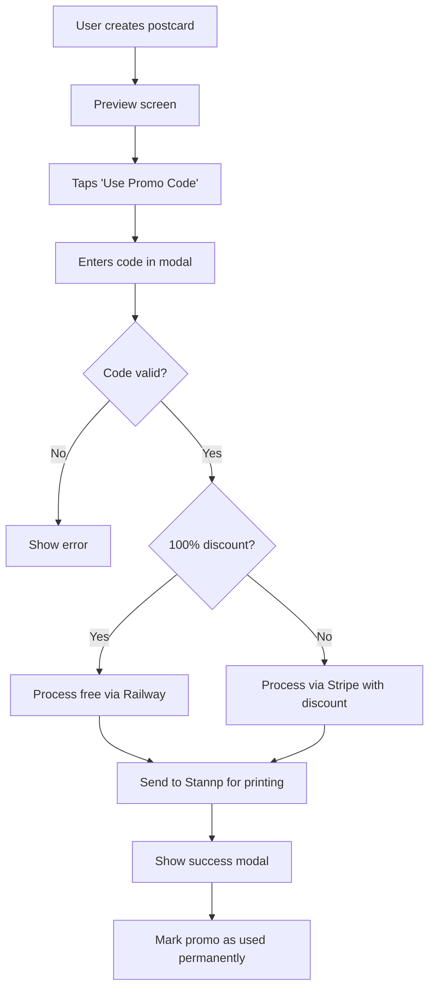

# XLPostcards Coupon System - Current Status

## 🎯 **Overview**
Complete promo code system implemented with Stripe-free flow for 100% discounts, database tracking, and automated monthly coupon generation.

---

## ✅ **What's Working**

### **Frontend (React Native)**
- ✅ Custom promo code modal with validation
- ✅ "Use Promo Code" link appears below Send button
- ✅ Permanent usage tracking (disappears until app reinstall)
- ✅ Direct send flow from modal (skips preview screen)
- ✅ Spinning loading modal during processing
- ✅ Button shows discount: "Send Your Postcard (FREE!)" or "(85% OFF!)"
- ✅ Smaller, centered button text with line break

### **Backend (Railway/FastAPI)**
- ✅ `/validate-promo-code` endpoint with full validation
- ✅ `/process-free-postcard` endpoint (bypasses Stripe entirely)
- ✅ Database integration with PostgreSQL
- ✅ Customer tracking without Stripe dependency
- ✅ Automated monthly coupon generation (XLWelcomeMonth format)
- ✅ Promo code redemption tracking and analytics

### **Database Schema**
- ✅ `coupon_campaigns` - Campaign management
- ✅ `coupon_codes` - Individual codes with usage limits
- ✅ `coupon_distributions` - Track postcards sent with codes
- ✅ `coupon_redemptions` - Track actual usage
- ✅ `customers` - First-time customer tracking (email-based)

### **Payment Flow**
- ✅ **100% discounts:** Skip Stripe, process free via Railway
- ✅ **Partial discounts:** Use Stripe with reduced amount
- ✅ **Abuse prevention:** 500 redemptions per month limit
- ✅ **One-time use:** Promo link disappears permanently after use

---

## 📍 **Current Coupon Design**

### **Postcard Back Placement**
- **Position:** Above address block (right side of postcard)
- **Sizes:**
  - **XL (6"x9"):** 700px × 300px
  - **Regular (4"x6"):** 500px × 220px

### **Current Design Elements**
```
┌─────────────────────────────────┐
│       Get XLPostcards App!      │
│   Download from App/Play Store  │
│                                 │
│      Code: XLWELCOMENOV        │
│      First postcard FREE!       │
└─────────────────────────────────┘
```
- **Background:** Light gray (#f8f8f8)
- **Border:** Orange (#f28914), 6px thick
- **Text:** Centered, various sizes
- **Colors:** Orange headers, dark gray body text

---

## 🎨 **Design Improvements Needed**

### **Visual Issues to Fix**
- [ ] **Make it look more like a coupon**
  - Add coupon-style design elements
  - Consider perforated edges or ticket-style appearance
  - Better visual hierarchy and typography
  
- [ ] **Improve color scheme**
  - Current orange/gray is bland
  - Consider more vibrant, attention-grabbing colors
  - Better contrast and readability
  
- [ ] **Add visual elements**
  - Icons or graphics
  - Better borders/frames
  - More professional branding integration

### **Content Improvements**
- [ ] **More compelling copy**
  - Current text is very basic
  - Could be more engaging and marketing-focused
  - Consider urgency/scarcity messaging

- [ ] **QR code integration**
  - Direct link to app stores
  - Easier for recipients to redeem

---

## 🔧 **Technical Implementation**

### **Key Files**
- **Frontend:** `app/postcard-preview.tsx` (lines 1230-1450 for modal)
- **Backend:** `PostcardService/main.py` (lines 1074-1165 & 1654-1745 for coupon generation)
- **Database:** `DATABASE_SCHEMA.sql`
- **Config:** `app.config.js` (version 2.3.3.2)

### **Environment Variables Needed**
- `DATABASE_URL` - PostgreSQL connection string
- `STRIPE_SECRET_KEY` - For partial discount processing
- All existing XLPostcards environment variables

---

## 🚀 **How to Test**

### **Setup**
1. Deploy latest code to Railway
2. Ensure `DATABASE_URL` environment variable is set
3. Database tables auto-create on first run

### **Testing Flow**
1. Create postcard normally
2. On preview screen, tap "Use Promo Code" (below Send button)
3. Enter: `XLWELCOMENOV`
4. Tap "Apply Promo Code and Send Postcard"
5. Should skip Stripe and process free postcard
6. "Use Promo Code" link disappears permanently

### **Testing Reset**
- Uninstall and reinstall app to reset promo code usage
- Perfect for development testing

---

## 📊 **Analytics Available**

### **Database Tracking**
- **Customer acquisition:** New vs returning customers
- **Redemption rates:** How many codes are actually used
- **Distribution tracking:** Which postcards included coupons
- **Monthly performance:** Usage by coupon campaign

### **Current Metrics**
- **Monthly limit:** 500 redemptions per code
- **Code format:** XLWelcome + Month (e.g., XLWelcomeNov)
- **Discount:** 100% (completely free)

---

## 🎯 **Next Steps**

### **Priority 1: Better Coupon Design**
- Research attractive coupon designs
- Implement more visually appealing layout
- Add professional graphics/branding
- Consider different color schemes

### **Priority 2: Enhanced Functionality**
- QR codes for app store links
- Multiple coupon designs/templates
- A/B testing different designs
- Usage analytics dashboard

### **Priority 3: Marketing Integration**
- Seasonal coupon designs
- Holiday-themed promotions
- Integration with email marketing
- Social media sharing features

---

## 🔄 **System Flow Summary**



---

## 📝 **Notes**
- System is fully functional and production-ready
- Main focus now is improving the visual design of the coupon
- All technical infrastructure is complete and robust
- Database tracking provides comprehensive analytics
- One-time use prevents abuse while allowing testing flexibility

**Last Updated:** October 3, 2025  
**Version:** 2.3.3.2  
**Status:** ✅ Fully Implemented - Design Improvements Needed