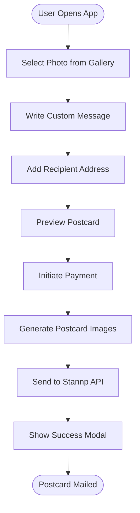
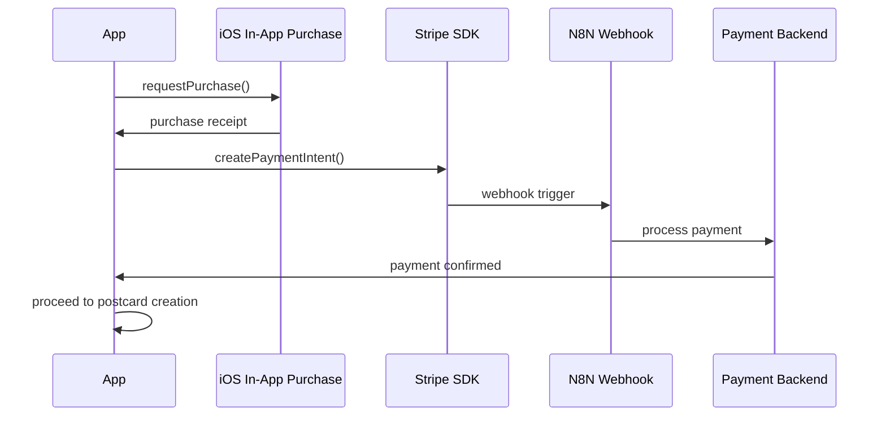
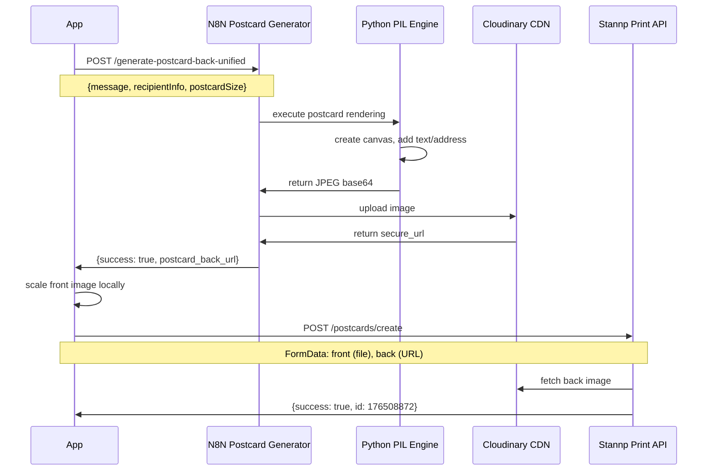
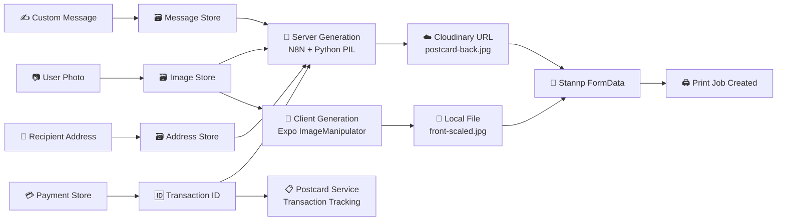
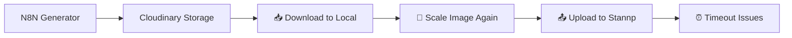
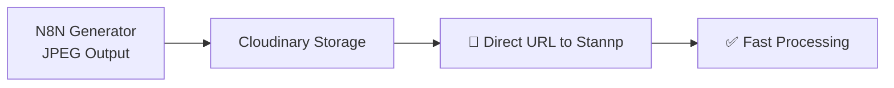
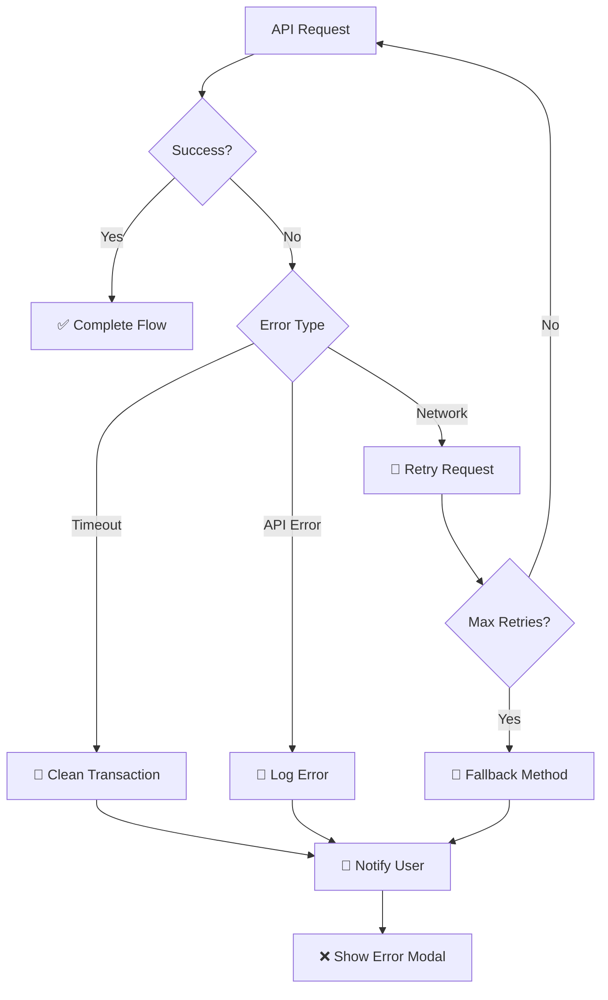

# XLPostcards App Architecture & API Flow

## Main User Flow



## Detailed API & Webhook Architecture

```mermaid
flowchart TB
    %% User Interface
    App[📱 XLPostcards App<br/>React Native + Expo] 
    
    %% Payment Flow
    App --> |1. Purchase Request| IAP[🍎 iOS In-App Purchase<br/>React Native IAP]
    IAP --> |2. Purchase Receipt| Stripe[💳 Stripe Payment Processing<br/>stripe-react-native]
    Stripe --> |3. Payment Intent| StripeWebhook[🔗 Stripe Webhook<br/>→ N8N Payment Processor]
    
    %% Image Generation Flow  
    App --> |4. Generate Request| N8NBack[🎨 N8N Postcard Back Generator<br/>Webhook: generate-postcard-back-unified]
    N8NBack --> |5. Python PIL Rendering| BackImage[🖼️ Postcard Back Image<br/>JPEG with Text & Address]
    BackImage --> |6. Upload| Cloudinary[☁️ Cloudinary CDN<br/>Image Storage & Optimization]
    
    %% Front Image Processing
    App --> |7. Scale & Process| FrontGen[🔧 Client-side Front Generation<br/>Expo ImageManipulator]
    FrontGen --> |8. Scaled Image| LocalFront[📁 Local Front Image<br/>JPEG with Bleed]
    
    %% Stannp Integration
    Cloudinary --> |9. Direct URL| StannpAPI[📮 Stannp Print API<br/>api-us1.stannp.com/v1/postcards/create]
    LocalFront --> |10. File Upload| StannpAPI
    App --> |11. FormData Request| StannpAPI
    
    %% Final Processing
    StannpAPI --> |12. Print Job Created| PrintSuccess[✅ Postcard Queued for Print]
    PrintSuccess --> |13. Status Response| App
    
    %% Error Handling
    StannpAPI --> |❌ API Error| ErrorHandler[⚠️ Error Handler<br/>Transaction Cleanup]
    ErrorHandler --> App
    
    %% External Services
    OpenAI[🤖 OpenAI API<br/>AI Message Generation] --> |Optional| WriteMessage
    
    %% State Management
    ZustandStore[🗃️ Zustand Stores<br/>• postcardStore<br/>• imageStore<br/>• addressStore<br/>• paymentStore] <--> App
    
    %% Local Storage
    AsyncStorage[💾 AsyncStorage<br/>• Transaction States<br/>• Address Book<br/>• User Preferences] <--> App

    %% Styling
    classDef apiService fill:#e1f5fe,stroke:#01579b,stroke-width:2px
    classDef webhook fill:#f3e5f5,stroke:#4a148c,stroke-width:2px  
    classDef storage fill:#e8f5e8,stroke:#2e7d32,stroke-width:2px
    classDef userInterface fill:#fff3e0,stroke:#ef6c00,stroke-width:2px
    classDef processing fill:#fce4ec,stroke:#c2185b,stroke-width:2px
    
    class IAP,Stripe,StannpAPI,OpenAI apiService
    class StripeWebhook,N8NBack webhook
    class Cloudinary,AsyncStorage,ZustandStore storage
    class App userInterface  
    class FrontGen,BackImage,LocalFront processing
```

## API Integration Details

### 1. **Payment Processing APIs**


### 2. **Postcard Generation APIs**


### 3. **Data Flow Architecture**


## Environment & Configuration

### **API Keys & Webhooks**
| Service | Environment Variable | Usage |
|---------|---------------------|-------|
| Stannp API | `STANNP_API_KEY` | Print postcards |
| Stripe | `STRIPE_PUBLISHABLE_KEY_TEST/LIVE` | Payment processing |
| OpenAI | `OPENAI_API_KEY` | AI message generation |
| N8N Webhook | `n8nPostcardBackWebhookUrl` | Server-side image generation |
| Cloudinary | Built into N8N workflow | Image storage/CDN |

### **Build Variants**
- **Development**: Test mode enabled, simulator builds
- **Preview**: Preview builds for testing  
- **Production**: Live API keys, production builds

## Key Performance Optimizations

### **Before Optimization**


### **After Optimization** ✅


## Error Handling & Recovery



This architecture ensures reliable postcard creation with multiple fallback mechanisms and comprehensive error handling across all API integrations.